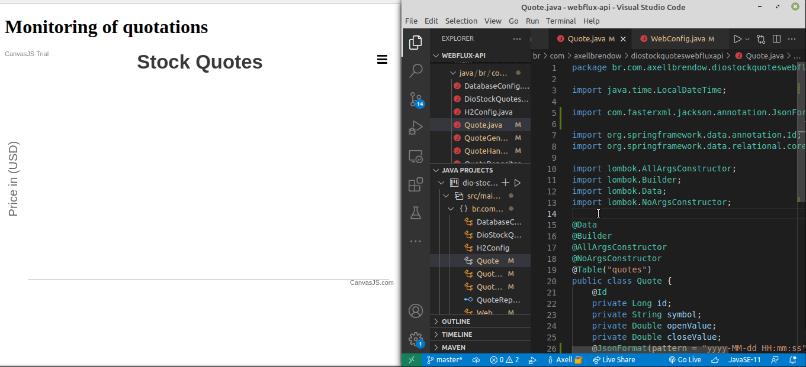

# dio-spring-webflux-stock-quote

<div>
    
    
</div>



## How to run the project ?

### Frontend

```sh
cd frontend
yarn  # Equivalent of npm install
yarn start  # Equivalent of npm start
```

### Backend

```sh
cd webflux-api
./mvnw spring-boot:run
```
